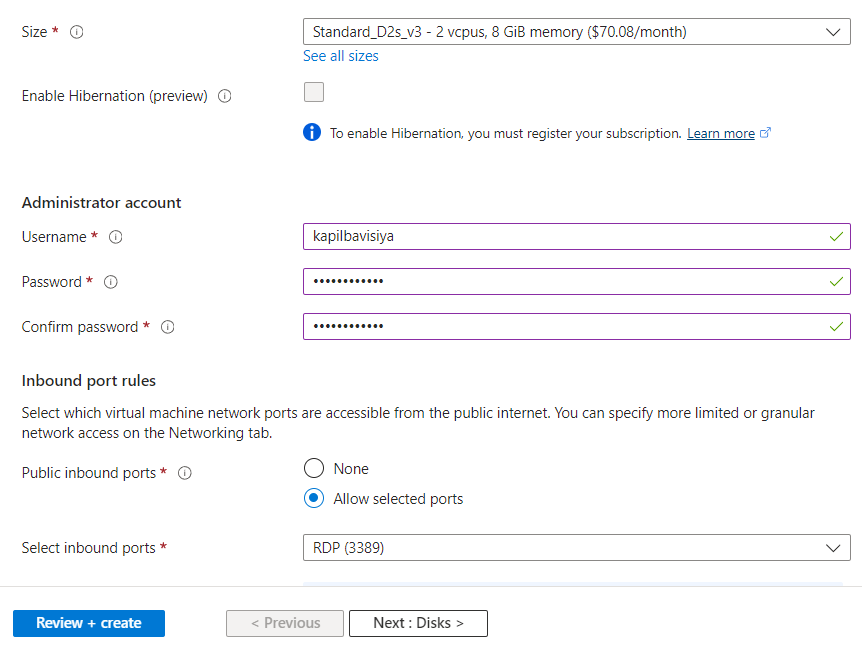
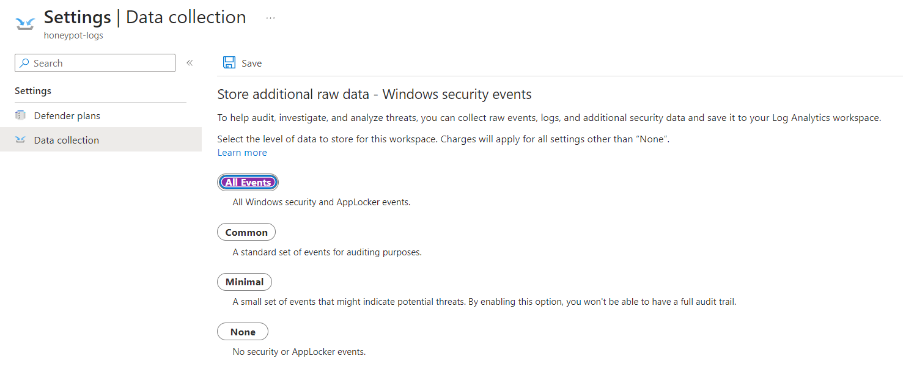

# SIEM-Microsoft-Sentinel-Lab

In this project, I have set up an Azure sentinel SIEM, configured a virtual machine that works as a honeypot, and deployed a log analytics workspace. Also, I understood Windows security event logs, used KQL (Kusto Query language, and displayed data on a world map using workbooks and 3rd party API (ipgeolocation.io). A special thanks to Josh Madakor.

Firstly, I have created a Microsoft Azure account. So that I can use all these services.

## Create Virtual Machine

On the Networking section, change the setting from basic to advanced in NIC network security group and create new network security group.

Now, remove default inbound rule, and we will create our own rule that allows everything into the VM.

And then click review+create to deploy our VM.

Next step is to deploy log analytics workspace using below criteria, we can use any names for this, I have used honeypot-logs.

Now, we go to Microsoft defender for cloud to enable the ability to gather logs from virtual machine into the log analytics workspace.
Servers: ON
SQL servers on machines: OFF

Now, go to Data collection section from left side panel, and select All events and hit Save, so our machine can catch everything.

Now, go to log analytics workspace -> our created workspace -> honeypotVM, and connect it.

While it connects to virtual machine, we can configure Microsoft Sentinel, for that search “Microsoft sentinel” and click Create, then select Log analytics workspace that we have created, and click Add.

Also, our VM got connected, and we should be able to get the IP address, by using that public IP address of honeypotVM, go to main computer and open Remote Desktop connection.

Now, paste that IP and use the username and password that we have used while creating for virtual machine setup.

## Disable the Firewall in Virtual Machine

We need to disable all the firewalls in our virtual machine, so it is exposed to the world, and everyone can try to get into our machine and we can record them.

In the virtual machine, search for “wf.msc” to open Windows Defender Firewall and open the properties. Turn off all 3 firewalls (Domain profile, Private profile, and Public profile). Click Apply and OK.

Now, In Event Viewer, under windows log, click on security, We get all the login attempts happening from everywhere.

## Scripting the Security Log Exporter

In the virtual machine, open Powershell ISE, copy and paste Powershell Script that is linked in this repository, and change API key. You can get API key by signing up in https://app.ipgeolocation.io/

Now run the powershell script and wait for some time to get real data of login attempts to your virtual machine. (You also can check by yourself by giving the wrong credentials while logging to VM). All the logs we would get in this output.

In virtual machine, there will be a file called failed_rdp.log after running it at location C:\ProgramData, which will be hidden. Copy all data and in our host PC, create same file and paste all the data.

## Create Custom Log in Log Analytics Workspace

For this, In Azure portal, go to Log Analytics Workspace > our workspace name (honeypot-logs) > In Tables > Add custom logs (MMA-based).

In Sample, select that file that we have copied from VM
In collection path, give “C:\ProgramData\failed_rdp.log’

Also, give custom name (In this project — FAILED_RDP_WITH_IPGEO), hit next and then create.

Now we will load data in General Query. For that, we need to go to logs and write the below query:

SecurityEvent (this query will give all Windows logs data of our virtual machine)
For our data, write FAILED_RDP_WITH_IPGEO_CL, we will get all failed login attempts)

This RawData is all together and messy, we need different columns for each attributes like latitude, longitude, destinationhost, country, sourcehost, label, IP address, etc. For this, use below script to separate all the data and it will give proper output that we need for mapping it in world map.

FAILED_RDP_WITH_GEO_CL | extend username = extract(@"username:([^,]+)", 1, RawData), timestamp = extract(@"timestamp:([^,]+)", 1, RawData), latitude = extract(@"latitude:([^,]+)", 1, RawData), longitude = extract(@"longitude:([^,]+)", 1, RawData), sourcehost = extract(@"sourcehost:([^,]+)", 1, RawData), state = extract(@"state:([^,]+)", 1, RawData), label = extract(@"label:([^,]+)", 1, RawData), destination = extract(@"destinationhost:([^,]+)", 1, RawData), country = extract(@"country:([^,]+)", 1, RawData)

## Map Data in Sentinel

Go to Microsoft sentinel, and under Threat Management, we need to create a workbook for it, after clicking on create workbook, Add workbook to sentinel, and we need to remove default widgets, so you can delete both the widgets.

We will provide our own query to show data on the world map. paste below code along with above code:

| where destination != “samplehost” | where sourcehost != “” | summarize event_count=count() by latitude, longitude, sourcehost, label, destination, country

And select Map from visualisation section. You will get layout setting option, default selected option will be fine, but if you want to change, you can according to how your map reacts to that setting.

Also, in Metric Setting, I have selected country to show all the logs from different country. Metric Label — Country and Metric Value — event_count

Select Apply and Save then close it. Also save that map in same region(RG1).

Reference: Josh Madakor

Thank you for reading.
